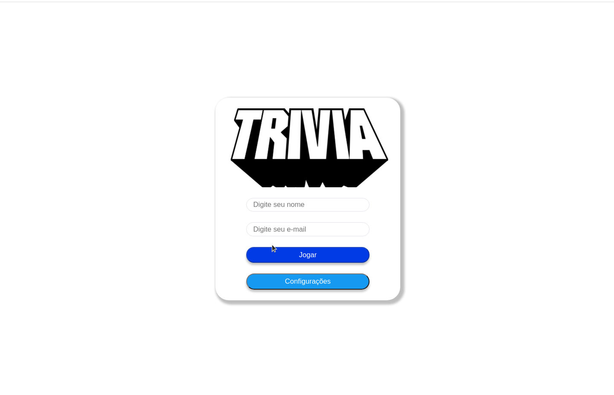

# Projeto Jogo de Trivia!

Esse projeto foi desenvolvido em grupo no curso de Desenvolvimento de Software Web da Trybe. O projeto desenvolvido é um jogo de perguntas e respostas baseado no jogo **Trivia** _(tipo um show do milhão americano rs)_ utilizando _React e Redux_, e suas funcionalidades foram desenvolvidad em grupo de acordo com as demandas definidas em um quadro _Kanban_. 

Nessa aplicação a pessoa usuária poderá:

  - Logar no jogo e, se o email tiver cadastro no site [Gravatar](https://pt.gravatar.com/), ter sua foto associada ao perfil de usuária.
  - Acessar a página referente ao jogo, onde se deverá escolher uma das respostas disponíveis para cada uma das perguntas apresentadas. A resposta deve ser marcada antes do contador de tempo chegar a zero, caso contrário a resposta deverá ser considerada errada.
  - Ser redirecionada, após 5 perguntas respondidas, para a tela de score, onde o texto mostrado depende do número de acertos.
  - Visualizar a página de ranking, se quiser, ao final de cada jogo.
  - Configurar algumas opções para o jogo em uma tela de configuração acessível a partir do cabeçalho do app.

<div>
  
</div>

---

# Tecnologias usadas

Nesse projeto, utilizamos:

  - Store Redux do React

  - Reducers no Redux

  - Actions no Redux

  - Dispatchers no Redux

  - Actions assíncronas com Redux Thunk.

---

# Instruções para rodar o projeto no seu computador:

## Antes de começar a desenvolver:

1. Clone o repositório
  * `git clone git@github.com:Matheushg156/Project-Trivia-Game.git`
  * Entre na pasta do repositório que você acabou de clonar:
    * `cd sd-014-b-project-trivia-react-redux`

2. Instale as dependências e inicialize o projeto
  * Instale as dependências:
    * `npm install`
  * Inicialize o projeto:
    * `npm start` (uma nova página deve abrir no seu navegador mostrando a página de login do game)


---

### API de Trivia

A [API do Trivia](https://opentdb.com/api_config.php) é bem simples. Utilizamos 2 endpoints para essa aplicação.

Primeiro, é necessário fazer um GET request para:

```
https://opentdb.com/api_token.php?command=request
```

Esse endpoint te retornará o token que vai ser utilizado nas requisições seguintes. A resposta dele será:

```
{
   "response_code":0,
   "response_message":"Token Generated Successfully!",
   "token":"f00cb469ce38726ee00a7c6836761b0a4fb808181a125dcde6d50a9f3c9127b6"
}
```

Para pegar as perguntas, você deve realizar um GET request para o seguinte endpoint:

```
https://opentdb.com/api.php?amount=${quantidade-de-perguntas-retornadas}&token=${seu-token-aqui}

// Recomendação
https://opentdb.com/api.php?amount=5&token=${seu-token-aqui}
```

Recomendamos pedir 5 perguntas de uma vez e controlar a disposição delas no código. Essa API te retorna as perguntas no seguinte formato:

```
// Pergunta de múltipla escolha
{
   "response_code":0,
   "results":[
      {
         "category":"Entertainment: Video Games",
         "type":"multiple",
         "difficulty":"easy",
         "question":"What is the first weapon you acquire in Half-Life?",
         "correct_answer":"A crowbar",
         "incorrect_answers":[
            "A pistol",
            "The H.E.V suit",
            "Your fists"
         ]
      }
   ]
}
```

```
// Pergunta de verdadeiro ou falso
{
   "response_code":0,
   "results":[
      {
         "category":"Entertainment: Video Games",
         "type":"boolean",
         "difficulty":"hard",
         "question":"TF2: Sentry rocket damage falloff is calculated based on the distance between the sentry and the enemy, not the engineer and the enemy",
         "correct_answer":"False",
         "incorrect_answers":[
            "True"
         ]
      }
   ]
}
```

---


### Gravatar

O Gravatar é um serviço que permite deixar o avatar global a partir do email cadastrado, ele mostra sua foto cadastrada em qualquer site vinculado. Na tela de **Inicio**, a pessoa que joga pode colocar um e-mail que deve fazer uma consulta a API do [Gravatar](https://br.gravatar.com/site/implement/images/).

A Implementação é feita baseada no e-mail. Esse email deve ser transformado em uma hash `MD5` (https://br.gravatar.com/site/implement/hash/). Para gerar esse hash, utilizamos o [CryptoJs](https://github.com/brix/crypto-js).

Por exemplo:
  - Garantida a instalação do CryptoJS no projeto, importe o MD5:
    `import md5 from 'crypto-js/md5';`

  - Converta o email do usuário:
    `md5(emailDoUsuário).toString();`

Após a geração da hash, basta adicionar o valor gerado no final da URL:

```
// Formato de URL necessário:
https://www.gravatar.com/avatar/${hash-gerada}

// Exemplo de URL com hash de uma pessoa
https://www.gravatar.com/avatar/205e460b479e2e5b48aec07710c08d50

// Exemplo de imagem exibida com a URL


```
---
